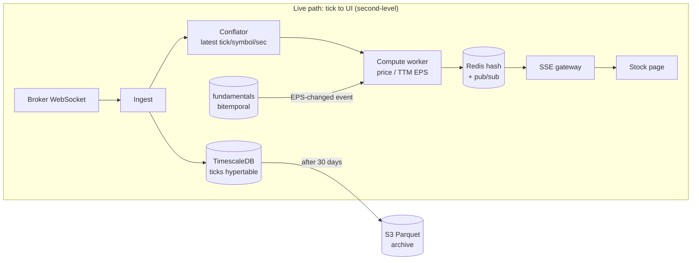
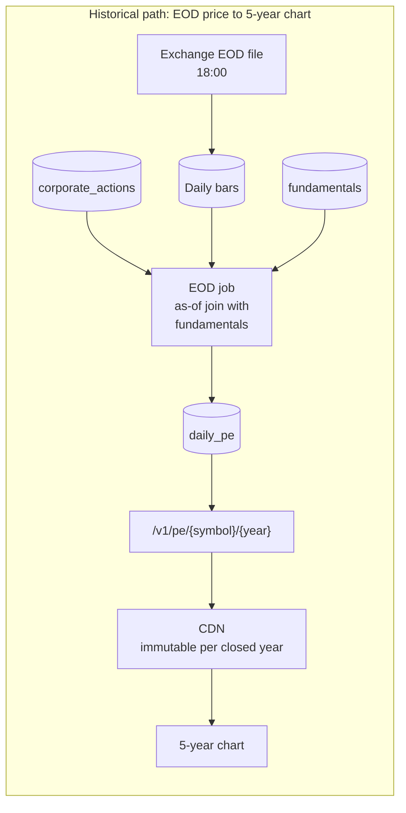

# Multi-Frequency Financial Data Platform — Technical Design

Problem Statement 2. Scope: NSE + BSE universe (~5,000 symbols), four data frequencies (tick, EOD,
quarterly, annual), serving live and historical derived metrics such as P/E.

The design follows one principle: **store immutable facts, derive everything else.** Every other
decision (bitemporal fundamentals, rollups that can be rebuilt, caching history forever) follows from it.

---

## Q1: Storage

### Sizing first

The brief calls tick data petabyte-scale. The numbers don't support that:

| Quantity | Estimate |
|---|---|
| Tick rate (5,000 symbols, one tick per ~300 ms) | ~15,000 ticks/s |
| Trading seconds per day (09:15–15:30) | 22,500 s |
| Ticks per year (250 sessions) | ~84 billion |
| Bytes per tick (ts, symbol id, LTP, volume) | ~32 B |
| **Raw per year** | **~2.7 TB** |
| **Compressed (columnar, ~10x)** | **~270 GB** |

At that rate, one petabyte would take hundreds of years. Level-1 ticks are **terabyte-scale**. Only
full order-book depth (L2/L3, 10–50x more data) plus replicas would push it towards petabytes. So the
design starts from one well-tuned node and scales out only when measurements say it must.

### Stack: TimescaleDB for both ticks and fundamentals

| Data | Storage | Why |
|---|---|---|
| Ticks | TimescaleDB **hypertable** (time-partitioned chunks, native columnar compression) | Append-heavy and time-ordered, which is exactly what hypertables are built for |
| Daily / 1-min bars | TimescaleDB **continuous aggregates** | OHLCV rollups kept up to date by the database, not by application code |
| Fundamentals, corporate actions | **Plain Postgres tables** in the same database | Small (5k symbols × a few metrics × 4 quarters/year), relational, queried by key through a B-tree index |
| Live metrics | Redis | Serving layer only, never the source of truth (see Q3) |

Why one engine: **P/E is a join between prices and fundamentals.** With both in one database, the join
runs inside a single query planner, with no network hop and no two systems to keep in sync. A small team
also runs one database, one backup and one set of dashboards.

**Where it loses:** market-wide scans (cross-sectional queries), such as ranking all 5,000 symbols on
10 years of momentum, are ClickHouse's strength and not Timescale's. **Exit criterion:** add ClickHouse
as an analytics **read replica**, fed by a nightly Parquet export, when either of these happens:
- research scans breach an agreed limit (e.g. p95 > 30 s), or
- research scans start competing with live serving for disk and CPU (workload isolation).

TimescaleDB remains the only place writes go.

### Point-in-time correctness: bitemporal fundamentals

Every fundamental fact carries two times:

- **`period_end`** is the *valid time*: which quarter the number describes (e.g. 2025-12-31).
- **`known_at`** is the *knowledge (transaction) time*: the moment the market could first see it.

```
fundamentals(symbol, metric, period_end, value, known_at)
PRIMARY KEY (symbol, metric, period_end, known_at)
```

**The table is append-only; nothing is ever `UPDATE`d.** A restatement is a new fact with its own `known_at`:

| symbol | metric | period_end | value | known_at |
|---|---|---|---|---|
| INFY | EPS | 2025-12-31 | 12.4 | 2026-01-14 19:00 |
| INFY | EPS | 2025-12-31 | 11.9 | 2026-07-10 18:00 |

**The rule for every calculation:** a price at time `t` joins only with facts where `known_at <= t`, and
the latest `known_at` wins (an **as-of join**). Consequences:

- **Q3 results at 7 PM Tuesday.** Tuesday's close was set before anyone saw them, so it uses the old
  EPS. The first price after 19:00, Wednesday's open, uses the new one. An 11 AM intraday filing takes
  effect from the next tick, on the same day. That is why `known_at` is a full timestamp, not a date.
- **Restatements.** "What did the market believe on Feb 1?" returns 12.4. "What is the true value?"
  returns 11.9. An `UPDATE` would lose the first answer. Backtests would then trade on information that
  did not exist yet (**look-ahead bias**): the returns look good in the backtest and disappear when real
  money is used. It would also break reproducibility for audit.
- **TTM EPS as of `t`** is the as-of value for each of the last four `period_end`s, summed.

**Corporate actions** follow the same model. The `corporate_actions` table records the split or bonus
ratio, its `ex_date`, and a `known_at` (announcements precede ex-dates by weeks). Raw prices and EPS are
stored **unadjusted**. The adjustment factor is applied at read time, to prices and EPS together, so a
1:2 split never shows up as a fake 50% crash. The P/E ratio itself needs no adjustment:
`raw price / EPS known that day` are in the same share basis, so the split cancels out.

### Retention and downsampling: archive, never delete

| Tier | Hot | Warm | Cold | Readers |
|---|---|---|---|---|
| Raw ticks | Uncompressed, ~7 days | Compressed, to 30 days | **S3 Parquet, forever** | Live UI (hot only), TCA, occasional research |
| 1-min OHLCV | Continuous aggregate | Compressed, to 2 years | S3 Parquet | Intraday charts, momentum |
| Daily OHLCV | Kept in the database forever (~60 MB/year) | — | — | P/E history, factor models, backtests |

The 7-day uncompressed window exists because writes into compressed chunks are expensive: exchange trade
corrections and ingest gap replays can arrive days late (a long weekend plus a holiday). Seven days covers
that with margin at ~75 GB of hot disk (2.7 TB / 250 sessions ≈ 11 GB/day); it is one policy setting,
tuned from the measured correction lag.

Deleting raw ticks cannot be undone, and keeping them costs almost nothing: roughly $6/month per year of
history on S3 Standard, less on Glacier. They are also needed for **transaction cost analysis**
(slippage of the Problem 1 execution engine's fills against the market at order time). Rollups are
therefore *derived and disposable*: they can always be rebuilt from the archive.

---

## Q2: The compute engine

There is no single strategy. The trigger is chosen per metric, by how fast each input moves.

| Metric / path | Strategy | Detail |
|---|---|---|
| Live P/E | **Conflated per-second micro-batch** | Keep only the latest tick per symbol and compute once a second: at most 5k divisions/s instead of 15k/s, with no visible loss at second-level freshness |
| EPS change | **Event-driven** | A new `fundamentals` row emits an event; the worker updates that symbol's in-memory TTM EPS and recomputes just that symbol |
| Momentum, yield | **Slow part on schedule, fast part live** | After the 18:00 EOD run, precompute the slow part (`price_252d_ago`, trailing dividends); each second, combine it with the live price |
| Historical P/E | **On schedule, after EOD** | The EOD job appends one `daily_pe` row per symbol (daily close joined as-of with TTM EPS) |

The general pattern: **precompute the slow-moving input, combine it with the fast input live.** The
compute worker keeps 5,000 TTM EPS values and 5,000 lookback prices in memory, a few hundred KB in
total, so the per-second loop never queries the database.

---

## Q3: APIs and serving

### Pattern A: live metrics in under 200 ms

- **Store:** the Redis hash `metrics:{symbol}` holds `{pe, momentum, yield, as_of}`. The compute
  worker overwrites it each second the symbol ticks (**write-through**), so there is nothing to invalidate.
- **Snapshot, then stream:** `GET /v1/metrics/{symbol}` runs one `HGETALL` (sub-millisecond) so the
  page is correct as soon as it opens. `GET /v1/metrics/{symbol}/stream` (**SSE**) then pushes updates.
  SSE is one-directional, runs over plain HTTP, reconnects automatically and works through load balancers.
  WebSocket's two-way channel isn't needed.
- **Fan-out:** the worker publishes to a Redis pub/sub channel per symbol. Each SSE node subscribes only
  to symbols that someone is viewing, so a thousand viewers of INFY cost one subscription.
- **Staleness over invalidation, with two separate clocks.** `as_of` is the last tick's time, so an
  illiquid stock that hasn't traded for 2 minutes honestly shows a 2-minute-old price. Worker liveness is
  separate: the worker refreshes one `worker:heartbeat` key (10 s TTL) every second, and when it is
  missing the API marks responses `stale`. A per-symbol TTL would expire quiet stocks while the worker is
  healthy. With workers split by symbol partition, it becomes one heartbeat per partition, so a stuck
  partition is caught too. **Visibly stale is safe; silently stale is dangerous.**

### Pattern B: 3-year P/E chart (~750 points)

A point-in-time series is **immutable by construction**. A restatement adds a row with a later
`known_at`, so it can never change a past point. Append-only storage (Q1) therefore makes history
cacheable forever. The design problem is the cache key.

- **Chunk by calendar year, not by sliding range.** `?from=2023-09-28&to=2026-09-27` becomes a new URL
  every day, and the hit rate collapses. Instead:
  - `GET /v1/pe/{symbol}/2024` is a closed year, served with `Cache-Control: public, max-age=31536000, immutable`.
  - `GET /v1/pe/{symbol}/2026` is the current year, with `max-age` set to the time left until the next EOD run.
  - A 3-year chart is four requests, three of which are almost always CDN edge hits.
- **Today's point** comes from the Pattern A live endpoint, so the history responses stay cacheable.
- **Fixing bad data:** browsers can't be purged, so the version goes in the path (`/v2/pe/...`). New
  URLs mean corrected data is fetched fresh and the bad cached copies are no longer requested.
- **On a miss:** one indexed range read on `daily_pe (symbol, date)` is milliseconds from Postgres.

---

## Q4: The full picture





The daily close comes from the exchange's official EOD file, not from the last tick: NSE's closing
price is a weighted average over the final 30 minutes, so the two differ.

### How the design answers the evaluation criteria

- **Systems thinking:** conflation caps compute at 5k/s. The CDN absorbs historical reads. Pub/sub
  fan-out decouples the number of viewers from compute load.
- **Financial nuance:** bitemporal, append-only fundamentals with as-of joins remove look-ahead bias by
  construction, and corporate actions are treated as point-in-time facts too.
- **Pragmatism:** one database, sized from measured volumes rather than an assumed "petabyte" load,
  with a measurable exit criterion for adding ClickHouse.
